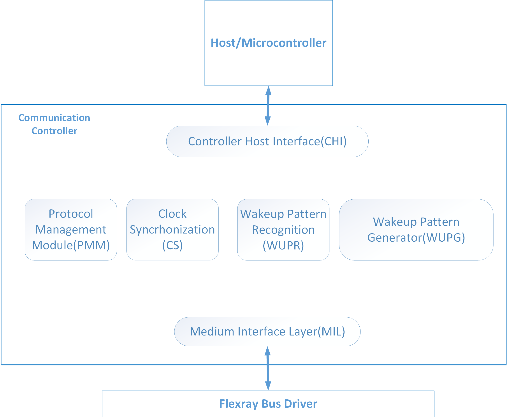

# Source Code

This directory contains the VHDL code used for the implementation of this thesis. In
addition to the circuit descriptions, corresponding testbenches are included for
verifying each module (filenames ending in `_tb`).

## General Architecture

  

## Module Structure

The source code is organized into the following modules, each corresponding to a
subdirectory:

| Folder       | Module                          |
|--------------|----------------------------------|
| `pmm/`       | Protocol Management Module       |
| `chi/`       | Controller Host Interface        |
| `mil/`       | Medium Interface Layer           |
| `wupg/`      | Wakeup Pattern Generator          |
| `wupr/`      | Wakeup Pattern Recognition        |
| `cs/`        | Clock Synchronisation             |
| `controller/`| Communication Controller (top-level) |

The `controller/` folder contains the top-level code that integrates all submodules
within the Communication Controller.

## Notes

- Some components (e.g., `dff.vhd`) are placed in a single module's folder for
  organizational purposes, but may be reused by other modules as well.
- Within each module's folder, the `main` file implements that module's top-level
  design by integrating its constituent components.
